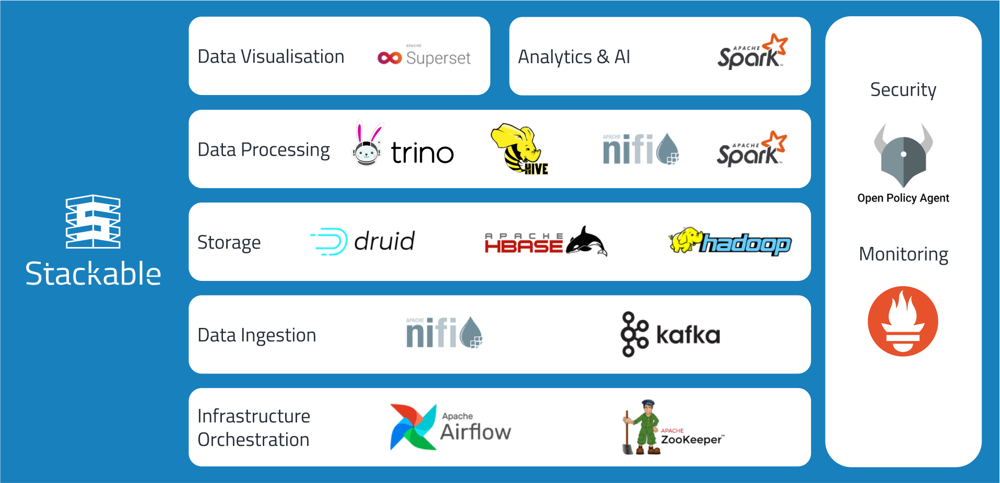

  

<h1 align="center">Stackable operator-rs</h1>

[Stackable Data Platform](https://stackable.tech/) | [Platform Docs](https://docs.stackable.tech/) | [Discussions](https://github.com/orgs/stackabletech/discussions) | [Discord](https://discord.gg/7kZ3BNnCAF)

This is a simple Rust library that includes all kinds of helper methods, structs and enums that can be used to write a Kubernetes Controller/Operator with the [kube-rs](https://github.com/kube-rs/kube-rs) crate.

It is part of the Stackable Data Platform, a curated selection of the best open source data apps like Apache Kafka, Apache Druid, Trino or Apache Spark, [all](#our-operators) working together seamlessly. Based on Kubernetes, Stackable is designed to run on prem or in the cloud.

## Documentation

This project is not featured in our main documentation documents. The code contains doc comments, and you can find explanations of high-level concepts
in the main documentation of the Stackable products at [docs.stackable.tech](https://docs.stackable.tech).

To see examples of how operator-rs is being used, take a look at the codebases of our [operator repositories](#our-operators).

If you have a question about the Stackable Data Platform contact us via our [homepage](https://stackable.tech/) or ask a public questions in our [Discussions forum](https://github.com/orgs/stackabletech/discussions).

## About The Stackable Data Platform

This operator is written and maintained by [Stackable](https://stackable.tech) and it is part of a larger data platform.

Stackable makes it easy to operate data applications in any Kubernetes cluster.

The data platform offers many operators, new ones being added continuously. All our operators are designed and built to be easily interconnected and to be consistent to work with.

The [Stackable GmbH](https://stackable.tech/) is the company behind the Stackable Data Platform. Offering professional services, paid support plans and custom development.

We love open-source!

## Our Operators

This library enables shared functionality across all operators that are currently part of the Stackable Data Platform:

* [Stackable Operator for Apache Airflow](https://github.com/stackabletech/airflow-operator)
* [Stackable Operator for Apache Druid](https://github.com/stackabletech/druid-operator)
* [Stackable Operator for Apache HBase](https://github.com/stackabletech/hbase-operator)
* [Stackable Operator for Apache Hadoop HDFS](https://github.com/stackabletech/hdfs-operator)
* [Stackable Operator for Apache Hive](https://github.com/stackabletech/hive-operator)
* [Stackable Operator for Apache Kafka](https://github.com/stackabletech/kafka-operator)
* [Stackable Operator for Apache NiFi](https://github.com/stackabletech/nifi-operator)
* [Stackable Operator for Apache Spark](https://github.com/stackabletech/spark-k8s-operator)
* [Stackable Operator for Apache Superset](https://github.com/stackabletech/superset-operator)
* [Stackable Operator for Trino](https://github.com/stackabletech/trino-operator)
* [Stackable Operator for Apache ZooKeeper](https://github.com/stackabletech/zookeeper-operator)

And our internal operators:

* [Commons Operator](https://github.com/stackabletech/commons-operator)
* [Listener Operator](https://github.com/stackabletech/listener-operator)
* [OpenPolicyAgent Operator](https://github.com/stackabletech/opa-operator)
* [Secret Operator](https://github.com/stackabletech/secret-operator)

## Contributing

Contributions are welcome. Follow our [Contributors Guide](https://docs.stackable.tech/home/stable/contributor/index.html) and the [CONTRIBUTING](./CONTRIBUTING.adoc) file to learn how you can contribute.

## License

[Apache License 2.0](./LICENSE).

## Support

You can use this project under different licenses. Get started with the community edition! If you want professional support, [we offer subscription plans](https://stackable.tech/en/plans/).
